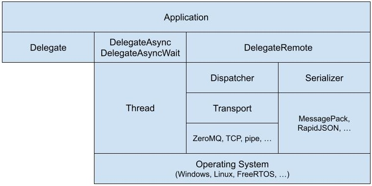

<br>


[](https://github.com/endurodave/DelegateMQ/actions/workflows/cmake_ubuntu.yml)
[](https://github.com/endurodave/DelegateMQ/actions/workflows/cmake_clang.yml)
[](https://github.com/endurodave/DelegateMQ/actions/workflows/cmake_windows.yml)
[](https://app.codecov.io/gh/endurodave/DelegateMQ)

# Delegates in C++

DelegateMQ is a C++ header-only library for invoking any callable (e.g., function, method, lambda):

- Synchronously
- Asynchronously
- Remotely across processes or processors

It unifies function calls across threads or systems via a simple delegate interface. A powerful, lightweight messaging library for thread-safe asynchronous callbacks, non-blocking APIs, and passing data between threads. DelegateMQ is thread-safe, unit-tested, and easy to port to any platform.

# Key Concepts

- `MakeDelegate` – Creates a delegate instance bound to a callable (lambda, function, or method).
- `MulticastDelegateSafe` – A thread-safe container of delegates, allowing broadcast-style invocation.
- `Thread` – A cross-platform thread class capable of asynchronous delegate invocation.

# Examples

Invoke `MsgOut()` using delegates.

```cpp
#include "DelegateMQ.h"

size_t MsgOut(const std::string& msg)
{
    std::cout << msg << std::endl;
    return msg.size();
}

// Examples to create and invoke sync, async and remote delegates
int main(void)
{
    Thread thread("WorkerThread");
    thread.CreateThread();

    auto sync = dmq::MakeDelegate(&MsgOut);
    sync("Invoke MsgOut sync!");

    auto async = dmq::MakeDelegate(&MsgOut, thread);
    async("Invoke MsgOut async (non-blocking)!");

    auto asyncWait = dmq::MakeDelegate(&MsgOut, thread, dmq::WAIT_INFINITE);
    size_t size = asyncWait("Invoke MsgOut async wait (blocking)!");

    auto asyncWait1s = dmq::MakeDelegate(&MsgOut, thread, std::chrono::seconds(1));
    auto retVal = asyncWait1s.AsyncInvoke("Invoke MsgOut async wait (blocking max 1s)!");
    if (retVal.has_value())     // Async invoke completed within 1 second?
        size = retVal.value();  // Get return value

    // Create remote delegate support objects
    std::ostringstream stream(std::ios::out | std::ios::binary);
    Dispatcher dispatcher;
    Serializer<void(const std::string&)> serializer;
    
    // Configure remote delegate
    dmq::DelegateFreeRemote<void(const std::string&)> remote(dmq::DelegateRemoteId(1));
    remote.SetStream(&stream);
    remote.SetDispatcher(&dispatcher);
    remote.SetSerializer(&serializer);

    // Invoke remote delegate
    remote("Invoke MsgOut remote!");
    return 0;
}
```

`Subscriber` registers with `Publisher` to receive asynchronous callbacks.

```cpp
class Publisher
{
public:
    // Thread-safe container to store registered callbacks
    dmq::MulticastDelegateSafe<void(const std::string& msg)> MsgCb;

    static Publisher& Instance() 
    {
        static Publisher instance;
        return instance;
    }

    void SetMsg(const std::string& msg) 
    {
        m_msg = msg;    // Store message
        MsgCb(m_msg);   // Invoke all registered callbacks
    }

private:
    Publisher() = default;
    std::string m_msg;
};

class Subscriber
{
public:
    Subscriber() : m_thread("SubscriberThread") 
    {
        m_thread.CreateThread();

        // Register for publisher async callback on m_thread context
        Publisher::Instance().MsgCb += dmq::MakeDelegate(this, &Subscriber::HandleMsgCb, m_thread);
    }

private:
    // Handle publisher callback on m_thread
    void HandleMsgCb(const std::string& msg) 
    {
         std::cout << msg << std::endl; 
    }
    Thread m_thread;
};
```

Multiple callables targets stored and broadcast invoked asynchronously.

```cpp
// Create an async delegate targeting lambda on thread1
auto lambda = [](int i) { std::cout << i; };
auto lambdaDelegate = dmq::MakeDelegate(std::function(lambda), thread1);

// Create an async delegate targeting Class::Func() on thread2
Class myClass;
auto memberDelegate = dmq::MakeDelegate(&myClass, &Class::Func, thread2);

// Create a thread-safe delegate container
dmq::MulticastDelegateSafe<void(int)> delegates;

// Insert delegates into the container 
delegates += lambdaDelegate;
delegates += memberDelegate;

// Invoke all callable targets asynchronously 
delegates(123);
```

Asynchronous public API reinvokes `StoreAsync()` call onto the internal `m_thread` context.

```cpp
// Store data using asynchronous public API. Class is thread-safe.
class DataStore
{
public:
    DataStore() : m_thread("DataStoreThread")
    {
        m_thread.CreateThread();
    }

    // Store data asynchronously on m_thread context (non-blocking)
    void StoreAsync(const Data& data)
    {
        // If the caller thread is not the internal thread, reinvoke this function 
        // asynchronously on the internal thread to ensure thread-safety
        if (m_thread.GetThreadId() != Thread::GetCurrentThreadId()) 
        {
            // Reinvoke StoreAsync(data) on m_thread context
            return dmq::MakeDelegate(this, &DataStore::StoreAsync, m_thread)(data);
        }
        m_data = data;  // Data stored on m_thread context
    }

private:
    Data m_data;        // Data storage
    Thread m_thread;    // Internal thread
};
```

# Overview

In C++, a delegate function object encapsulates a callable entity, such as a function, method, or lambda, so it can be invoked later. A delegate is a type-safe wrapper around a callable function that allows it to be passed around, stored, or invoked at a later time, typically within different contexts or on different threads. Delegates are particularly useful for event-driven programming, callbacks, asynchronous APIs, or when you need to pass functions as arguments.

Originally published on CodeProject at <a href="https://www.codeproject.com/Articles/5277036/Asynchronous-Multicast-Delegates-in-Modern-Cpluspl">Asynchronous Multicast Delegates in Modern C++</a> with a perfect 5.0 article feedback rating.

## Sync Delegates

Synchronous delegates invoke the target function anonymously within the current execution context. No external library dependencies are required.

## Async Delegates

Asynchronous delegates support both non-blocking and blocking invocation modes, including optional timeouts. The library enables anonymous invocation of any callable target, regardless of the number or type of arguments, or the presence of a return value. All argument types are supported — including by value, pointers, pointer-to-pointer, and references. Smart pointer delegates prevents async invocation on destroyed target objects.

The delegate library abstracts the complexities of invoking functions across thread boundaries. Concrete examples are provided below, with straightforward paths to porting across platforms.

* **Operating System:** Windows, Linux, [FreeRTOS](https://github.com/FreeRTOS/FreeRTOS)

## Remote Delegates

Remote delegates enable function invocation across processes or processors using customizable serialization and transport mechanisms. All argument data is marshaled to support remote callables with any function signature. The design allows easy integration with new transport or serialization libraries. Concrete examples using supported libraries are provided below. 

* **Serialization:** [MessagePack](https://msgpack.org/index.html), [RapidJSON](https://github.com/Tencent/rapidjson), [Cereal](https://github.com/USCiLab/cereal), [Bitsery](https://github.com/fraillt/bitsery), [MessageSerialize](https://github.com/endurodave/MessageSerialize)
* **Transport:** [ZeroMQ](https://zeromq.org/), [NNG](https://github.com/nanomsg/nng), [MQTT](https://github.com/eclipse-paho/paho.mqtt.c), UDP, data pipe, memory buffer
 
**Cross-Language**: A Python application using ZeroMQ and MessagePack communicates with a DelegateMQ C++ application, demonstrating how remote delegates easily bridge high-level scripts and low-level native code.

## Delegate Semantics and Use Cases

It is always safe to call the delegate. In its null state, a call will not perform any action and will return a default-constructed return value. A delegate behaves like a normal pointer type: it can be copied, compared for equality, called, and compared to `nullptr`. Const correctness is maintained; stored const objects can only be called by const member functions.

 A delegate instance can be:

 * Copied freely.
 * Compared to same type delegates and `nullptr`.
 * Reassigned.
 * Called.
 
Typical use cases are:

* Synchronous and Asynchronous Callbacks
* Event-Driven Programming
* Inter-Process and Inter-Processor Communication 
* Inter-Thread Publish/Subscribe (Observer) Pattern
* Thread-Safe Asynchronous API
* Asynchronous Method Invocation (AMI) 
* Design Patterns (Active Object)
* `std::async` Thread Targeting

# Modular Architecture

DelegateMQ uses an external thread, transport, and serializer, all of which are based on simple, well-defined interfaces.

<br>
*DelegateMQ Layer Diagram*

The library's flexible CMake build options allow for the inclusion of only the necessary features. Synchronous, asynchronous, and remote delegates can be used individually or in combination.

# Getting Started

To build and run DelegateMQ, follow these simple steps. The library uses <a href="https://www.cmake.org">CMake</a> to generate build files and supports Visual Studio, GCC, and Clang toolchains.

1. Clone the repository.
2. From the repository root, run the following CMake command:   
   `cmake -B build .`
3. Build and run the project within the `build` directory. 

See [Sample Projects](docs/DETAILS.md#sample-projects) to build other project examples. See [Porting Guide](docs/DETAILS.md#porting-guide) for details on porting to a new platform.

# Documentation

 - See [Design Details](docs/DETAILS.md) for a [porting guide](docs/DETAILS.md#porting-guide), design documentation and [more examples](docs/DETAILS.md#sample-projects).
 - See [Doxygen Documentation](https://endurodave.github.io/DelegateMQ/html/index.html) for source code documentation. 
 - See [Unit Test Code Coverage](https://app.codecov.io/gh/endurodave/DelegateMQ) test results.

# Motivation

Systems are composed of various design patterns or libraries to implement callbacks, asynchronous APIs, and inter-thread or inter-processor communications. These elements typically lack shared commonality. Callbacks are one-off implementations by individual developers, messages between threads rely on OS message queues, and communication libraries handle data transfer complexities. However, the underlying commonality lies in the need to move argument data to the target handler function, regardless of its location.

The DelegateMQ middleware effectively encapsulates all data movement and function invocation within a single library. Whether the target function is a static method, class method, or lambda—residing locally in a separate thread or remotely on a different processor—the library ensures the movement of argument data (marshalling when necessary) and invokes the target function. The low-level details of data movement and function invocation are neatly abstracted from the application layer.

# Features

DelegateMQ at a glance. 

| Category | DelegateMQ |
| --- | --- |
| Purpose | Unify callable invocation across threads, processes, and networks |
| Usages | Callbacks (synchronous and asynchronous), asynchronous API's, communication and data distribution, and more |
| Library | Allows customizing data sharing between threads, processes, or processors |
| Object Lifetime | Thread-safe management via smart pointers (`std::weak_ptr`) prevents async invocation on destroyed objects (no dangling pointers). |
| Complexity | Lightweight and extensible through external library interfaces and full source code |
| Threads | No internal threads. External configurable thread interface portable to any OS (`IThread`). |
| Watchdog | Configurable timeout to detect and handle unresponsive threads. |
| Multicast | Broadcast invoke anonymous callable targets onto multiple threads |
| Message Priority | Asynchronous delegates support prioritization to ensure timely execution of critical messages |
| Serialization | External configurable serialization data formats, such as MessagePack, RapidJSON, or custom encoding (`ISerializer`) |
| Transport | External configurable transport, such as ZeroMQ, TCP, UDP, serial, data pipe or any custom transport (`ITransport`)  |
| Timeouts and Retries | Provided by a communication library (e.g. ZeroMQ REQ-REP (Request-Reply)), TCP/IP stack, or custom solution (`ITransportMonitor`) |
| Message Buffering | Remote delegate message buffering provided by a communication library (e.g. ZeroMQ) or custom solution within transport |
| Dynamic Memory | Heap or DelegateMQ fixed-block allocator |
| Debug Logging | Debug logging using spdlog C++ logging library |
| Error Handling | Configurable for return error code, assert or exception |
| Embedded Friendly | Yes. Any OS such as Windows, Linux and FreeRTOS. An OS is not required (i.e. "super loop"). |
| Operation System | Any. Custom `IThread` implementation may be required. |
| Language | C++17 or higher |

# Alternative Implementations

Alternative asynchronous implementations similar in concept to DelegateMQ, simpler, and less features.

* <a href="https://github.com/endurodave/AsyncCallback">Asynchronous Callbacks in C++</a> - A C++ asynchronous callback framework.
* <a href="https://github.com/endurodave/C_AsyncCallback">Asynchronous Callbacks in C</a> - A C language asynchronous callback framework.

# Other Projects Using DelegateMQ

Repositories utilizing the DelegateMQ library.

* <a href="https://github.com/endurodave/StateMachineWithModernDelegates">C++ State Machine with Asynchronous Delegates</a> - a framework combining a C++ state machine with the asynchronous delegate library.
* <a href="https://github.com/endurodave/AsyncStateMachine">Asynchronous State Machine Design in C++</a> - an asynchronous C++ state machine implemented using an asynchronous delegate library.
* <a href="https://github.com/endurodave/IntegrationTestFramework">Integration Test Framework using Google Test and Delegates</a> - a multi-threaded C++ software integration test framework using Google Test and DelegateMQ libraries.
* <a href="https://github.com/endurodave/Async-SQLite">Asynchronous SQLite API using C++ Delegates</a> - an asynchronous SQLite wrapper implemented using an asynchronous delegate library.


