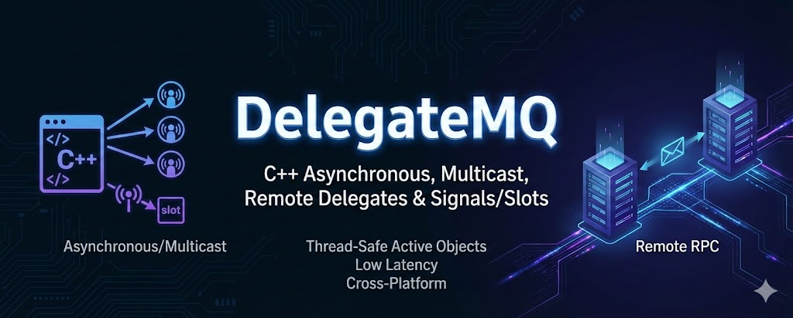
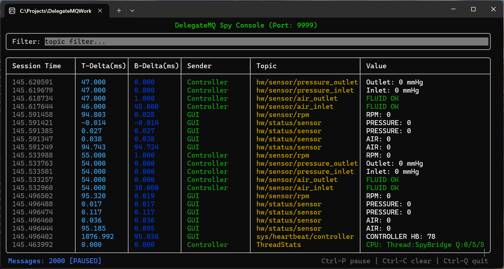
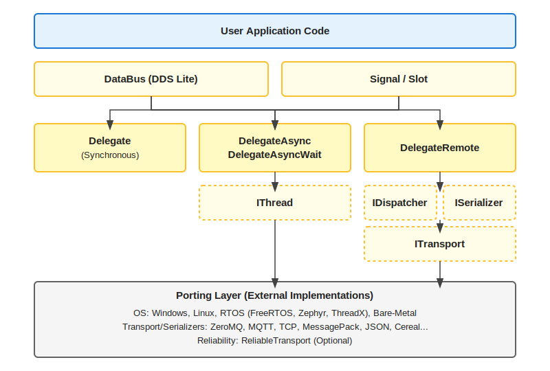

<div align="left">
  
</div>
<br>


[](https://github.com/DelegateMQ/DelegateMQ/actions/workflows/cmake_ubuntu.yml)
[](https://github.com/DelegateMQ/DelegateMQ/actions/workflows/cmake_clang.yml)
[](https://github.com/DelegateMQ/DelegateMQ/actions/workflows/cmake_windows.yml)


# Delegates in C++

DelegateMQ is a C++ header-only library for invoking any callable (e.g., function, method, lambda):

* Synchronously
* Asynchronously (Blocking and non-blocking)
* Multicast (Signal and Slot)
* Remotely (Across processes or processors)
* Topic-based (Publish/Subscribe across threads or nodes)

It serves as a messaging layer for C++ applications, providing thread-safe asynchronous callbacks, a Signal & Slot mechanism, topic-based data distribution (`dmq::databus::DataBus`), and inter-thread data transfer. The library is unit-tested and has been ported to numerous embedded and PC platforms (e.g. Windows, Linux, RTOS, bare metal), with a design that facilitates easy porting to others.

**Key Use Cases**
* **Callbacks**: Synchronous and asynchronous execution.
* **Signals & Slots**: Decoupled event handling supporting mixed synchronous and asynchronous observers.
* **DataBus (DDS Lite)**: Topic-based publish/subscribe distribution across threads or remote nodes.
* **Async APIs**: Thread-safe non-blocking function calls.
* **Data Distribution**: Passing data reliably between threads.
* **Remote Communication**: Inter-Process (IPC) and Inter-Processor messaging.
* **Event-Driven Architecture**: Building responsive, non-blocking systems.

DelegateMQ is completely modular. You can use only the features you need—such as basic synchronous delegates—without the overhead of asynchronous or remote features.

# Getting Started

[CMake](https://cmake.org/) is used to create the project build files on any Windows or Linux machine. DelegateMQ supports Visual Studio, GCC, Clang, and ARM toolchains.

1. Clone the repository.
2. From the repository root, run the following CMake command:   
   `cmake -B build .`
3. Build and run the project within the `build` directory. 

See [Example Projects](docs/DETAILS.md#example-projects) to build more project examples (remote/IPC, embedded). See [Porting Guide](docs/PORTING.md) for details on porting to a new platform.

# Overview

In C++, a delegate function object encapsulates a callable entity, such as a function, method, or lambda, so it can be invoked later. A delegate is a type-safe wrapper around a callable function that allows it to be passed around, stored, or invoked at a later time, typically within different contexts or on different threads. Delegates are particularly useful for event-driven programming, signal-slots, data distribution, callbacks, asynchronous APIs, or when you need to pass functions as arguments.

DelegateMQ serves as a middleware library that utilizes simple, pure virtual interface classes for the OS, transport, and serializer. This architecture allows easy swapping of underlying technologies without changing application logic.

Originally published on CodeProject at <a href="https://www.codeproject.com/Articles/5277036/Asynchronous-Multicast-Delegates-in-Modern-Cpluspl">Asynchronous Multicast Delegates in Modern C++</a> with a perfect 5.0 article feedback rating.

## Key Concepts

- `dmq::MakeDelegate` – Creates a delegate bound to any callable. Adding a `dmq::Thread` argument makes it asynchronous; adding a `dmq::RemoteChannel` makes it remote. The call syntax is the same in all three cases.
- `dmq::Thread` – A cross-platform thread class. Passed to `dmq::MakeDelegate` to dispatch a call to a specific worker thread.
- `dmq::RemoteChannel<Sig>` – Owns the transport wiring for one message signature. Call `Bind()` once to configure, then invoke with `operator()` to send remotely.
- `dmq::Signal<Sig>` – Thread-safe multicast signal. `Connect()` returns a `dmq::ScopedConnection` that auto-disconnects on scope exit. Declare as a plain class member — no `shared_ptr` required.
- `dmq::MulticastDelegateSafe` – Thread-safe delegate container for broadcast invocation without RAII connection management.
- `dmq::databus::DataBus` – High-level topic-based middleware for data distribution. Enables location-transparent "publish/subscribe" across threads or remote nodes.

## Synchronous Delegates

Synchronous delegates invoke the target function anonymously within the current execution context. No external library or OS dependencies are required.

```cpp
#include "DelegateMQ.h"

size_t MsgOut(const std::string& msg)
{
    std::cout << "[" << std::this_thread::get_id() << "] " << msg << std::endl;
    return msg.size();
}

int main()
{
    // 1. Synchronous Invocation
    auto sync = dmq::MakeDelegate(&MsgOut);
    sync("Invoke MsgOut sync!");
    return 0;
}
```

## Asynchronous Delegates

Asynchronous delegates simplify multithreaded programming by allowing you to invoke functions across thread boundaries safely and effortlessly. This enables the Active Object pattern, where method execution is decoupled from method invocation. The library automatically marshals all arguments—whether passed by value, pointer, or reference—ensuring thread safety without manual locking or complex queue management. The library is designed for easy porting to any platform by simply implementing a lightweight threading interface (`dmq::IThread`).

**Key Features:**

* **Thread Marshalling:** Transfers execution and arguments from a caller thread to a target thread.
* **Smart Pointer Safety:** Prevents callbacks on destroyed objects using weak pointers, ensuring fail-safe async execution.
* **Invocation Modes:** 
  * **Non-Blocking:** Fire-and-forget execution.
  * **Blocking:** Wait for the target thread to complete execution (with optional timeouts).
  * **Asynchronous:** Use standard `std::future` to retrieve results later.

```cpp
dmq::Thread thread("WorkerThread");
thread.CreateThread();

// 1. Asynchronous Invocation (Non-blocking / Fire-and-forget)
auto async = dmq::MakeDelegate(&MsgOut, thread);
async("Invoke MsgOut async (non-blocking)!");

// 2. Asynchronous Invocation (Blocking / Wait for result)
auto asyncWait = dmq::MakeDelegate(&MsgOut, thread, dmq::WAIT_INFINITE);
size_t size = asyncWait("Invoke MsgOut async wait (blocking)!");

// 3. Asynchronous Invocation with Timeout
auto asyncWait1s = dmq::MakeDelegate(&MsgOut, thread, std::chrono::seconds(1));
auto retVal = asyncWait1s.AsyncInvoke("Invoke MsgOut async wait (blocking max 1s)!");
if (retVal.has_value())     // Async invoke completed within 1 second?
    size = retVal.value();  // Get return value
```

### Asynchronous Public API Example

Asynchronous public API reinvokes `StoreAsync()` call onto the internal `m_thread` context.

```cpp
struct Data { int x = 0; };

// Store data using asynchronous public API. Class is thread-safe.
class DataStore
{
public:
    DataStore() : m_thread("DataStoreThread")
    {
        m_thread.CreateThread();
    }

    // 1. Store data asynchronously on m_thread context (non-blocking)
    void StoreAsync(const Data& data)
    {
        // 2. If the caller thread is not the internal thread, reinvoke this function
        //    asynchronously on the internal thread to ensure thread-safety
        if (!m_thread.IsCurrentThread())
        {
            // 3. Reinvoke StoreAsync(data) on m_thread context
            dmq::MakeDelegate(this, &DataStore::StoreAsync, m_thread)(data);
            return;
        }
        // 4. Data stored on m_thread context
        m_data = data;  
    }

private:
    Data m_data;        // Data storage
    dmq::Thread m_thread;    // Internal thread
};
```

## Signal / Slot

`dmq::Signal<Sig>` is a thread-safe multicast signal. Emit it like a function call; each connected slot receives the call independently, on whichever thread it chose at connect time. `Connect()` returns a `dmq::ScopedConnection` that auto-disconnects when it goes out of scope — no manual unsubscribe needed.

Declare the signal as a plain class member — no `shared_ptr` or heap allocation required:

```cpp
class Button
{
public:
    dmq::Signal<void(int buttonId)> OnPressed;  // plain member

    void Press(int id) { OnPressed(id); }       // emit to all connected slots
};
```

Connect a slot and store the `dmq::ScopedConnection` for automatic lifetime management:

```cpp
class UI
{
public:
    UI(Button& btn) : m_thread("UIThread")
    {
        m_thread.CreateThread();

        // Slot dispatched to m_thread on every Press()
        m_conn = btn.OnPressed.Connect(
            dmq::MakeDelegate(this, &UI::HandlePress, m_thread)
        );
    }
    // No explicit disconnect needed — m_conn disconnects when UI is destroyed

private:
    void HandlePress(int buttonId) { std::cout << "Button " << buttonId << "\n"; }

    dmq::Thread m_thread;
    dmq::ScopedConnection m_conn;
};

Button btn;
{
    UI ui(btn);
    btn.Press(1);   // UI::HandlePress queued on UIThread
}                   // ui destroyed -> m_conn disconnects
btn.Press(2);       // safe: no subscribers, nothing happens
```

**`dmq::Signal` vs `dmq::MulticastDelegateSafe`** — use `dmq::Signal` by default; reach for `dmq::MulticastDelegateSafe` only when subscription lifetime is fully explicit:

| | `dmq::Signal<Sig>` | `dmq::MulticastDelegateSafe<Sig>` |
|---|---|---|
| Subscription | `Connect()` → `dmq::ScopedConnection` | `operator+=` → no return value |
| Unsubscription | Automatic on scope exit | Manual `operator-=` |
| Lifetime safety | Safe — disconnects even if Signal outlives subscriber | Caller responsible; missed `-=` leaves dangling subscriber |
| Mixed sync/async slots | Yes | Yes |

See [Publish / Subscribe with Signal](docs/SIGNALS.md) for lambda slots, mixed sync/async slots, and additional patterns.

## Remote Delegates

Remote delegates extend the library to enable Remote Procedure Calls (RPC) across process or network boundaries. This allows you to invoke a function on a remote machine as easily as calling a local function. The system automatically handles argument marshaling, serialization, and thread dispatching.

`dmq::RemoteChannel<Sig>` is the single setup object per message signature. Construct it with a transport and serializer, call `Bind()` once to wire the target function and remote ID, then invoke with `operator()`. The receiver registers its channel endpoint so incoming messages are automatically dispatched to the bound function.

**Key Features:**

* **No IDL Required:** Works with standard C++ types and structs.
* **Invocation Modes:** Supports Blocking (synchronous wait), Non-blocking (fire-and-forget), and Futures (asynchronous return values).
* **Transport Agnostic:** The application layer is decoupled from the physical transport. You can easily integrate custom transports or serializers. Implement `dmq::transport::ITransport` for any medium (TCP, UDP, serial, shared memory, etc.).

```cpp
#include "DelegateMQ.h"

// Shared message ID (both sides must agree)
constexpr dmq::DelegateRemoteId MSG_ID = 1;

// --- Receiver side (remote process/processor) ---
class MsgReceiver
{
public:
    MsgReceiver(dmq::transport::ITransport& transport, dmq::ISerializer<void(std::string)>& ser)
        : m_channel(transport, ser)
    {
        m_channel.Bind(this, &MsgReceiver::OnMsg, MSG_ID);
        dmq::RegisterEndpoint(MSG_ID, m_channel.GetEndpoint());  // app-defined routing table
    }

private:
    void OnMsg(std::string msg) { MsgOut(msg); }  // called on receive
    dmq::RemoteChannel<void(std::string)> m_channel;
};

// --- Sender side (local process/processor) ---
class MsgSender
{
public:
    MsgSender(dmq::transport::ITransport& transport, dmq::ISerializer<void(std::string)>& ser)
        : m_channel(transport, ser)
    {
        // Bind to a raw lambda (no std::function wrapper needed)
        m_channel.Bind([](std::string msg) { MsgOut(msg); }, MSG_ID);
    }

    void Send(const std::string& msg) { m_channel(msg); }  // fire-and-forget

private:
    dmq::RemoteChannel<void(std::string)> m_channel;
};
```

**Supported Integrations:**

* **Serialization:** [MessagePack](https://msgpack.org/index.html), [RapidJSON](https://github.com/Tencent/rapidjson), [Cereal](https://github.com/USCiLab/cereal), [Bitsery](https://github.com/fraillt/bitsery), [MessageSerialize](https://github.com/endurodave/MessageSerialize)
* **Transport:** [ZeroMQ](https://zeromq.org/), [NNG](https://github.com/nanomsg/nng), [MQTT](https://github.com/eclipse-paho/paho.mqtt.c), [Serial Port](https://github.com/sigrokproject/libserialport), TCP, UDP, ARM LwIP, ThreadX NetX/Duo, Zephyr Networking, data pipe, memory buffer

## Delegate Semantics

It is always safe to call the delegate. In its null state, a call will not perform any action and will return a default-constructed return value. A delegate behaves like a normal pointer type: it can be copied, compared for equality, called, and compared to `nullptr`. Const correctness is maintained; stored const objects can only be called by const member functions.

 A delegate instance can be:

 * Copied freely.
 * Compared to same type delegates and `nullptr`.
 * Reassigned.
 * Called.

See [Delegate Invocation Semantics](docs/DETAILS.md#delegate-invocation-semantics) for information on target callable invocation and argument handling based on the delegate type.

# DataBus (DDS Lite)

`dmq::databus::DataBus` is a high-level middleware built on DelegateMQ's core delegates. It provides a topic-based distribution system (similar to a lightweight DDS or MQTT) that works seamlessly across local threads and remote network nodes. Unlike full DDS style systems, DataBus is lightweight enough for small embedded systems and handles thread-safe data delivery to the specified thread of control.

**Features:**
- **Topic-Based**: Components communicate via string-named topics (e.g., "sensor/data").
- **Location Transparency**: Subscribers don't know if the data came from a local thread or a remote processor.
- **Unicast & Multicast**: Supports point-to-point reliable delivery (Unicast) or one-to-many "Best Effort" distribution (Multicast).
- **Quality of Service (QoS)**: Supports Last Value Cache (LVC) to ensure new subscribers receive the most recent data immediately.
- **Monitoring**: Built-in "spy" support via `dmq::databus::DataBus::Monitor()` to receive a callback for every message published on the bus.
- **Type Safety**: Runtime type checking ensures topic data types match between publishers and subscribers.
- **Zero Library Threads**: `dmq::databus::DataBus` creates no internal threads. The application owns a single polling thread that calls `dmq::databus::Participant::ProcessIncoming()` — every thread is visible and under application control.
- **[Mixed-Platform](docs/DATABUS.md#example-multi-node-topology)**: Runs unchanged across Linux, FreeRTOS, and bare-metal nodes. Complex topologies (Linux ↔ Ethernet ↔ FreeRTOS ↔ UART ↔ bare metal) are supported.

```cpp
#include "DelegateMQ.h"

// 1. Subscribe to a topic (dispatched to a worker thread)
auto conn = dmq::databus::DataBus::Subscribe<float>("sensor/temp", [](float value) {
    std::cout << "Received temp: " << value << std::endl;
}, &workerThread);

// 2. Publish data to the topic
dmq::databus::DataBus::Publish<float>("sensor/temp", 25.5f);

// 3. Optional: Enable Last Value Cache (LVC)
dmq::databus::QoS qos;
qos.lastValueCache = true;
auto conn2 = dmq::databus::DataBus::Subscribe<int>("status", [](int s) {
    // New subscribers get the last published value immediately
}, nullptr, qos);
```

**Distributed Example**: See [Cellutron](https://github.com/DelegateMQ/DelegateMQ/tree/master/example/cellutron) for a comprehensive distributed medical instrument example showcasing multi-OS interoperability (Desktop ↔ RTOS), safety interlocks, and distributed hardware logging using the DataBus.

# DelegateMQ Tools

DelegateMQ includes built-in diagnostic tools for monitoring and inspecting DataBus traffic and network topology in real-time. Two TUI (Terminal User Interface) consoles are provided:

| Tool | Purpose |
|------|---------|
| **`dmq-spy`** | Real-time live feed of all DataBus messages — acts as a "Software Logic Analyzer" |
| **`dmq-monitor`** | Live network topology view — shows all active nodes, status, uptime, and published topics |



**Key Features:**
- **Live Traffic Feed**: Real-time display of all messages published to the DataBus.
- **Regex Filtering**: Instantly filter topics using regular expressions to focus on specific data streams.
- **Node Topology**: See every node on the network — hostname, IP, uptime, message count, and health status.
- **Zero Impact**: Uses an asynchronous bridge to ensure monitoring never blocks or slows your application.
- **Cross-Platform**: Built with [FTXUI](https://github.com/ArthurSonzogni/FTXUI), providing a responsive dashboard in any terminal.

To build the tools, enable `DMQ_TOOLS` during configuration:

```bash
cmake -DDMQ_TOOLS=ON -B build .
cmake --build build --config Release
```

To integrate monitoring into your application, enable `DMQ_DATABUS_TOOLS` in your app's build. See [tools/TOOLS.md](tools/TOOLS.md) for full integration and usage details.

# Modular Architecture

DelegateMQ uses an external thread, transport, and serializer, all of which are based on simple, well-defined interfaces.

<br>
*DelegateMQ Layer Diagram*

The library's flexible CMake build options allow for the inclusion of only the necessary features. Synchronous, asynchronous, and remote delegates can be used individually or in combination.

# Documentation

 - See [Design Details](docs/DETAILS.md) for design documentation and [more examples](docs/DETAILS.md#sample-projects). See [Porting Guide](docs/PORTING.md) for platform porting and interface implementation.
 - See [Technology Comparison](docs/COMPARISON.md) for how DelegateMQ compares to DDS, gRPC, Qt signals, Boost.Signals2, `std::async`, and OS message queues.
 - See [Doxygen Documentation](https://endurodave.github.io/DelegateMQ/html/index.html) for source code documentation.

# Advantages

Key advantages of using DelegateMQ in your application.

| Advantage | Description |
| --- | --- |
| One invocation model | Sync, async, and remote delegates share the same `dmq::MakeDelegate` syntax — promoting a call to async or remote is a one-line change. |
| Runs everywhere C++ runs | Small pure-virtual interfaces (`dmq::IThread`, `dmq::transport::ITransport`) mean the same application code compiles on Windows, Linux, FreeRTOS, and bare metal. |
| No imposed dependencies | Header-only core requires only C++17; serialization, transport, and threading are injected externally with no mandatory third-party packages. |
| Application owns every thread | No internal threads are created — every `dmq::Thread` is constructed by the application, keeping scheduling, watchdogs, and stack sizes explicit and auditable. |
| Gradual adoption | Use synchronous delegates first, add a `dmq::Thread` to go async, add a `dmq::RemoteChannel` to go cross-process — each step is independent and reversible. |
| Targeted thread dispatch | Callbacks, signal slots, and DataBus subscribers each specify the thread they run on — the library handles the dispatch, so handlers always execute in the correct thread context without manual queuing. |
| Off-target development | The stdlib port lets embedded application logic run and be tested on a Windows or Linux host without target hardware; moving to the device swaps the thread port (e.g. FreeRTOS) and transport — application code is unchanged. |
| DataBus location transparency | Subscribers receive data identically whether the publisher is in the same thread, a different process, or a remote processor — no code change when moving between local and remote. |

# Features

DelegateMQ at a glance. 

| Category | DelegateMQ |
| --- | --- |
| Purpose | Unify callable invocation across threads, processes, and networks |
| Usages | Callbacks (synchronous and asynchronous), asynchronous API's, communication and data distribution, and more |
| Library | Allows customizing data sharing between threads, processes, or processors |
| Object Lifetime | Thread-safe management via smart pointers (`std::weak_ptr`) prevents async invocation on destroyed objects (no dangling pointers). |
| Complexity | Lightweight and extensible through external library interfaces and full source code |
| Threads | No internal threads. External configurable thread interface portable to any OS (`dmq::IThread`). |
| Watchdog | Configurable timeout to detect and handle unresponsive threads. |
| Signal and Slots | Standard Signal-Slot pattern (`dmq::Signal<Sig>`). `Connect()` returns a `dmq::ScopedConnection` for RAII auto-disconnect. Thread-safe by default; no `shared_ptr` required. |
| Multicast | Broadcast invoke anonymous callable targets onto multiple threads |
| DataBus | Topic-based middleware distribution system (DDS Lite) across threads or remote nodes |
| Interop | Python and C# client libraries (`interop/`) communicate with any C++ DataBus application over UDP using MessagePack — no C++ required on the client side |
| Message Priority | Asynchronous delegates support prioritization to ensure timely execution of critical messages |
| Serialization | External configurable serialization data formats, such as MessagePack, RapidJSON, or custom encoding (`dmq::ISerializer`) |
| Transport | External configurable transport, such as ZeroMQ, TCP, UDP, serial, data pipe or any custom transport (`dmq::transport::ITransport`)  |
| Transport Reliability | Provided by the built-in reliability layer (`dmq::util::ReliableTransport`) or communication library (e.g. ZeroMQ, nng, TCP/IP stack). | |
| Message Buffering | Remote delegate message buffering provided by a communication library (e.g. ZeroMQ) or custom solution within transport |
| Dynamic Memory | Heap or DelegateMQ fixed-block allocator |
| Debug Logging | Debug logging using spdlog C++ logging library |
| Error Handling | Configurable for return error code, assert or exception |
| Embedded Friendly | Yes. Any OS such as Windows, Linux and FreeRTOS. An OS is not required (i.e. "super loop"). |
| Operation System | Any. Custom `dmq::IThread` implementation may be required. |
| Language | C++17 or higher |

# Motivation

Systems are composed of various design patterns or libraries to implement callbacks, asynchronous APIs, and inter-thread or inter-processor communications. These elements typically lack shared commonality. Callbacks are one-off implementations by individual developers, messages between threads rely on OS message queues, and communication libraries handle data transfer complexities. However, the underlying commonality lies in the need to move argument data to the target handler function, regardless of its location.

The DelegateMQ middleware effectively encapsulates all data movement and function invocation within a single library. Whether the target function is a static method, class method, or lambda—residing locally in a separate thread or remotely on a different processor—the library ensures the movement of argument data (marshalling when necessary) and invokes the target function. The low-level details of data movement and function invocation are neatly abstracted from the application layer.

# Alternative Implementations

Alternative asynchronous implementations similar in concept to DelegateMQ, simpler, and less features.

| Project | Description |
| :--- | :--- |
| [Asynchronous Callbacks in C++](https://github.com/endurodave/AsyncCallback) | A C++ asynchronous callback framework. |
| [Asynchronous Callbacks in C](https://github.com/endurodave/C_AsyncCallback) | A C language asynchronous callback framework. |

# Other Projects Using DelegateMQ

Repositories utilizing the DelegateMQ library.

| Project | Description |
| :--- | :--- |
| [Integration Test Framework](https://github.com/DelegateMQ/IntegrationTestFramework) | A multi-threaded C++ software integration test framework using Google Test and DelegateMQ libraries. |
| [Active-Object State Machine in C++](https://github.com/DelegateMQ/active-fsm) | A modern active-object C++ finite state machine providing RAII-safe asynchronous dispatch and pub/sub signals. |
| [Async-SQLite](https://github.com/DelegateMQ/Async-SQLite) | An asynchronous SQLite thread-safe wrapper implemented using an asynchronous delegate library. |
| [Async-DuckDB](https://github.com/DelegateMQ/Async-DuckDB) | An asynchronous DuckDB thread-safe wrapper implemented using an asynchronous delegate library. |
| [Async-HTTP](https://github.com/DelegateMQ/Async-HTTP) | An asynchronous HTTP thread-safe client wrapper implemented using an asynchronous delegate library. |
