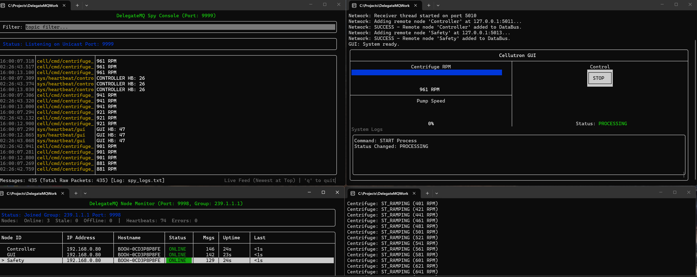
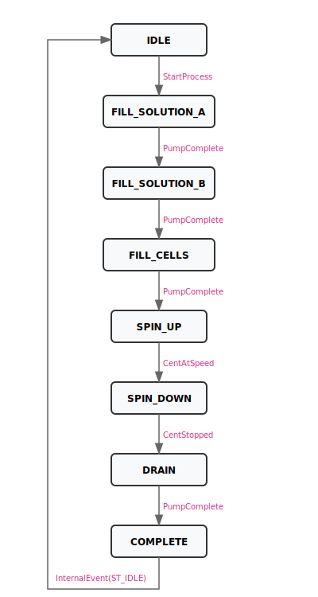
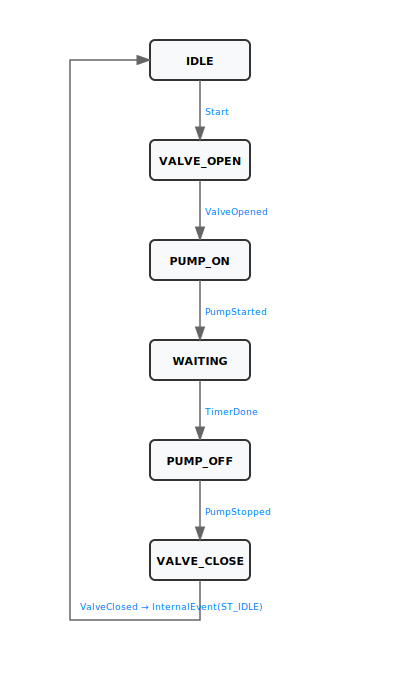

# Cellutron — Cell Processing System

**Cellutron** (located in `DelegateMQ/example/cellutron`) is a comprehensive demonstration project representing a hypothetical **medical, safety-critical instrument**. It showcases how **DelegateMQ** enables the design of distributed systems that require high reliability, independent hardware interlocks, and rigorous audit trails.



---

## Quick Start

The Cellutron system is designed to run entirely on Windows, with the Controller and Safety nodes operating within a **FreeRTOS Win32 simulation** to emulate embedded hardware behavior.

1.  **Initialize Workspace**: Ensure `DelegateMQ` is placed inside a workspace directory (e.g., `DelegateMQWorkspace`). From the repository root, run the setup scripts to fetch dependencies and build tools:
    ```powershell
    python 01_fetch_repos.py
    python 02_build_libs.py
    python 03_generate_samples.py
    python 04_build_samples.py
    python 05_run_samples.py
    ```
2.  **Build Cellutron**: From this directory (`example/cellutron/`), run:
    ```powershell
    cmake -B build .
    cmake --build build --config Debug
    ```
3.  **Run Cellutron**: Launch all three processors and spy tools:
    ```powershell
    python run_cellutron.py
    ```

---

## Why Cellutron?

The Cellutron project serves as a "Real-World" demonstration of DelegateMQ in a multi-processor, safety-critical context. It showcases how DelegateMQ middleware runs on top of Windows/Linux and FreeRTOS using async signals/slots, DataBus, and multithreading to solve the challenges inherent in modern instrument engineering.

---

## DelegateMQ Feature Showcase

Cellutron demonstrates all major DelegateMQ functional areas in a single integrated application.

- **Distributed DataBus**: Many-to-Many communication between three distributed CPUs and dozens of internal threads using location-transparent named topics.
- **QoS (Last Value Cache)**: Critical status topics use LVC to ensure new subscribers (like a late-starting GUI) immediately receive the current instrument state.
- **Active Objects**: Every major subsystem (State Machines, UI, Actuators) is an independent Active Object owning its own thread.
- **Zero-Lock Concurrency**: Asynchronous delegates handle all inter-thread data marshalling, allowing thread-safe state machines without manual mutexes.
- **Synchronous-over-Asynchronous**: Demonstrates blocking hardware abstractions where a thread blocks until an asynchronous hardware operation confirms completion.
- **RAII Signal & Slot**: Uses `dmq::Signal` with `dmq::ScopedConnection` for automatic cleanup of internal events when components are destroyed.
- **Non-Intrusive Monitoring**: Uses the `Monitor()` feature to "spy" on the distributed bus for audit logging without modifying core application logic.
- **Triangle Heartbeat**: Cross-node health monitoring via `dmq::databus::DeadlineSubscription`. Missed heartbeats trigger a coordinated system-wide `FAULT`.
- **Multi-OS Portability**: Identical application source code runs on **Standard C++ (GUI CPU)** and **FreeRTOS (Controller/Safety CPUs)**.
- **Explicit Queue Policy**: Every active object thread declares an explicit `FullPolicy` — `BLOCK` for reliability-critical threads (Controller/Safety system and process threads), `FAULT` for the network receiver, and `DROP` for non-critical display threads (UI, Logs). No thread silently inherits an unintended default.

---

## Architecture Overview

### Hardware Topology


The system is distributed across three independent processors (CPUs) communicating over a **Hybrid TCP/UDP** distributed **DataBus**. 

- **TCP (Guaranteed)**: Used for critical control commands (Start, Abort) and Fault events to ensure zero data loss.
- **UDP (Low Latency)**: Used for high-frequency telemetry (RPM, Sensors) and Heartbeats where speed is prioritized over reliability.

| CPU Node | Operating System | Primary Responsibility |
|:---|:---|:---|
| **GUI CPU** | Windows/Linux (stdlib) | HMI, Data Visualization, and System-wide Logging. |
| **Controller CPU** | FreeRTOS (Win32 Sim) | Process orchestration and hardware sequencing. |
| **Safety CPU** | FreeRTOS (Win32 Sim) | Independent hardware monitoring and interlock enforcement. |

### Thread Topology

Every CPU uses a standardized thread architecture for network I/O and Active Object dispatch. Most `dmq::os::Thread` instances are protected by the **DelegateMQ Watchdog** (30-second timeout); exceptions are noted below. FreeRTOS tasks (Controller/Safety) are OS-managed and listed separately.

#### GUI CPU
| Thread | Role | Description |
|:---|:---|:---|
| **Main Thread** | UI Event Loop | Runs FTXUI `screen.Loop()` — handles keyboard/mouse input and terminal rendering. |
| **TickThread** | System Tick | Calls `System::Tick()` every 50 ms from `main()` while the UI loop blocks. No watchdog. |
| **Watchdog** | Watchdog Loop | Calls `Thread::WatchdogCheckAll()` every 100 ms to detect and report deadlocks. |
| **GUI_SystemThread** | Active Object SM | Runs system-level logic, coordinates heartbeat, and dispatches DataBus callbacks. |
| **GUI_TimerThread** | Timer Dispatch | Drives `Timer::ProcessTimers()` and the 100 ms system tick. No watchdog. |
| **GUI_NetworkThread** | Multi-Protocol Poller | Polls UDP telemetry and TCP command links; owned by the `Network` singleton. |
| **UIThread** | DataBus Callbacks | Receives DataBus subscription callbacks and posts FTXUI screen refresh events. |
| **AlarmsThread** | Alarm Monitor | Processes fault events and `DeadlineSubscription` watchdog callbacks. |
| **LogsThread** | File I/O | Writes the `logs.txt` audit trail. Uses a 20-second watchdog timeout. |

#### Controller CPU
| Thread | Role | Description |
|:---|:---|:---|
| **Controller Task** | OS Orchestration | FreeRTOS task (`vControllerTask`); calls `System::Initialize()` then ticks at 100 ms. |
| **SysTimer** | Timer Dispatch | FreeRTOS software timer (10 ms period); calls `Timer::ProcessTimers()`. |
| **Watchdog Task** | OS Watchdog | FreeRTOS task (`vWatchdogTask`); calls `Thread::WatchdogCheckAll()` every 100 ms. |
| **Controller_SystemThread** | Active Object SM | Runs system-level logic and dispatches DataBus callbacks (start/stop/fault). |
| **Controller_NetworkThread** | Multi-Protocol Poller | Listens for TCP commands and broadcasts UDP telemetry; owned by `Network` singleton. |
| **ProcessThread** | Process State Machine | Runs `CellProcess` and `PumpProcess` state machines for instrument sequencing. |
| **ActuatorsThread** | Hardware Output | Executes valve and pump commands via blocking synchronous calls. |
| **SensorsThread** | Hardware Input | Queries pressure and air-in-line sensors. |

#### Safety CPU
| Thread | Role | Description |
|:---|:---|:---|
| **Safety Task** | OS Orchestration | FreeRTOS task (`vSafetyTask`); calls `System::Initialize()` then ticks at 100 ms. |
| **SysTimer** | Timer Dispatch | FreeRTOS software timer (10 ms period); calls `Timer::ProcessTimers()`. |
| **Watchdog Task** | OS Watchdog | FreeRTOS task (`vWatchdogTask`); calls `Thread::WatchdogCheckAll()` every 100 ms. |
| **Safety_SystemThread** | Active Object SM | Monitors centrifuge speed and publishes fault events over TCP when limits are exceeded. |
| **Safety_NetworkThread** | Multi-Protocol Poller | Listens for real-time RPM/command updates via UDP and TCP; owned by `Network` singleton. |

### Pneumatics System


The instrument controls a fluid path using a manifold of valves and a single peristaltic pump:
- **Valves V1-V3**: Divert fluids (Solution A, B, or Cells) into the main process line.
- **Pump (ID 1)**: Precise bi-directional flow control (Forward for filling, Reverse for draining).
- **Centrifuge**: High-speed separation chamber for cell processing.
- **Valve V4**: Controls the final drain path to waste.
- **Sensors**: Real-time pressure (P) and air-in-line (A) monitoring at the inlet and outlet of the pump manifold.

---

## Communication Model (Distributed DataBus)

Cellutron uses a "DDS-Lite" approach where data is exchanged via named **Topics**. The DataBus abstracts the network, allowing publishers and subscribers to interact seamlessly across CPU boundaries.

### Topic Mapping

| Topic | Publisher | Subscribers | Description |
|:---|:---|:---|:---|
| `Command` | GUI CPU | Controller CPU | Commands to start or abort the cell processing sequence. |
| `Status` | Controller CPU | GUI CPU | High-level system state (Idle, Processing, Aborting, Fault). |
| `Control` | Controller CPU | GUI CPU, Safety CPU | Real-time centrifuge RPM setpoints. |
| `Hardware`| Controller CPU | GUI CPU (logs) | Feedback on valve toggles, pump speed, and sensor snapshots. |
| `Fault` | Safety CPU | Controller CPU, GUI CPU | Critical safety violation event. |

---

## Controller State Machines

The Controller CPU orchestration is driven by nested state machines. The high-level process manages the overall sequence, while sub-processes handle atomic hardware actions.

### CellProcess State Machine
The `CellProcess` state machine (Active Object) manages the high-level instrument sequence. It coordinates with the `PumpProcess` and the `Centrifuge` actuator to move fluid and process cells.



### PumpProcess State Machine
The `PumpProcess` is a sub-state machine used by `CellProcess` to perform a standardized fluid transfer. It ensures that a valve is opened, the pump reaches speed, a duration expires, the pump is stopped, and the valve is closed in a deterministic, synchronous sequence.



---

## Implementation Details

- **Serialization**: Uses the `msg_serialize` port for compact binary transmission.
- **Shared Constants**: Centralized in `common/util/Constants.h`.
- **Async Marshalling**: Cross-thread and cross-processor logic is unified via DelegateMQ delegates.

---

## Namespace Organization

The project uses a strict nested namespace architecture for clarity and to prevent collisions:
- `cellutron::process`: High-level process logic and state machines (Controller).
- `cellutron::gui`: User interface terminal logic and visualization (GUI).
- `cellutron::safety`: Independent safety monitoring and fault logic (Safety).
- `cellutron::actuators`: Hardware driver abstractions (Valve, Pump, Centrifuge).
- `cellutron::sensors`: Hardware sensor abstractions (Pressure, Air).
- `cellutron::util`: Networking, data serialization, and common system utilities.
- `cellutron::hw`: Shared hardware data types.
