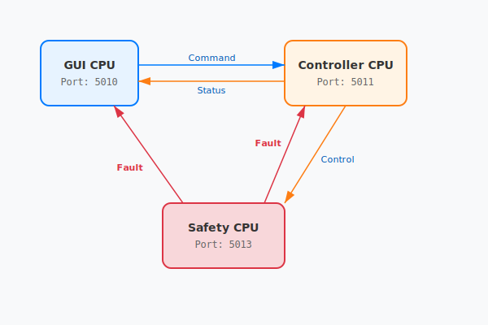

# Cellutron — Cell Processing System

**Cellutron** (located in `DelegateMQ/example/cellutron`) is a comprehensive demonstration project representing a hypothetical **medical, safety-critical instrument**. It showcases how **DelegateMQ** enables the design of distributed systems that require high reliability, independent hardware interlocks, and rigorous audit trails.

---

## Quick Start

1.  **Initialize Workspace**: From the workspace root (`C:\Projects\DelegateMQWorkspace\DelegateMQ\`), run:
    ```powershell
    python 01_fetch_repos.py
    ```
2.  **Build**: From this directory (`cellutron/`), run:
    ```powershell
    cmake -B build .
    cmake --build build --config Debug
    ```
3.  **Run**: Launch all three processors:
    ```powershell
    python run_cellutron.py
    ```

---

## Why Cellutron?

The Cellutron project serves as a "Real-World" demonstration of DelegateMQ in a multi-processor, safety-critical context. Unlike simple library examples, it showcases how DelegateMQ solves the challenges inherent in medical device engineering:

- **Safety Critical Isolation**: The system implements a dedicated **Safety CPU**. In medical devices, hardware interlocks must often be independent of the main control logic. Cellutron demonstrates an autonomous watchdog that can override the Controller if hardware limits are exceeded.
- **Heterogeneous Environments**: It runs identical application logic across diverse environments. The **GUI CPU** runs on a standard desktop OS, while the **Controller** and **Safety** nodes run on the **FreeRTOS Win32 Simulator**. This "sandbox" allows real RTOS kernel code and task-based logic to execute as standard Windows processes, providing a high-fidelity simulation of the microcontrollers found in modern instruments.
- **Traceability and Audit Trails**: The **logs** subsystem demonstrates non-intrusive monitoring. It "spies" on the distributed bus to provide a timestamped audit trail of all commands, status changes, and raw hardware actions (valves/sensors)—a fundamental requirement for regulatory compliance (e.g., FDA/CE).
- **Concurrency without Locks**: Each processor uses the **Active Object** pattern. DelegateMQ's asynchronous delegates handle all data marshalling, allowing developers to write thread-safe state machines without the risk of deadlocks associated with manual mutex management.

---

## DelegateMQ Feature Showcase

Cellutron is designed to be the definitive reference for DelegateMQ, exercising all major functional areas of the library in a single integrated application.

### 1. Distributed DataBus (Local & Remote)
- **Many-to-Many**: Data flows seamlessly between three distributed CPUs and dozens of internal threads.
- **Location Transparency**: Publishers (like the Controller) and Subscribers (like the GUI) interact via named topics without knowing if the counterpart is in the same thread or across the network.
- **QoS (Last Value Cache)**: Critical state topics like `status/run` use LVC. If the GUI is restarted mid-process, it immediately receives the current instrument state from the bus.

### 2. Active Objects & Thread Marshalling
- **Dedicated Execution**: Every major subsystem (State Machines, Network, UI, Logs, Actuators, Sensors) is an independent **Active Object** owning its own thread.
- **Zero-Lock Concurrency**: DelegateMQ handles all inter-thread data marshalling. Developers write standard sequential code within state functions while the library ensures thread-safety without manual mutexes.

### 3. Synchronous-over-Asynchronous APIs
- **Blocking Hardware Abstraction**: The `Actuators` and `Sensors` subsystems return values (`int`), forcing the calling process thread to **block** until the hardware thread confirms completion. This demonstrates how to build a synchronous, easy-to-read API for asynchronous hardware interactions.

### 4. Signal & Slot (Multicast)
- **RAII Safety**: Uses `dmq::Signal` with `dmq::ScopedConnection` for internal events (e.g., `OnTargetReached`). This ensures that if a component is destroyed, its callbacks are automatically and safely disconnected to prevent "latent" calls to dead objects.
- **Event-Driven Design**: The `CellProcess` state machine is driven by asynchronous signals from the `Centrifuge` motor simulation.

### 5. Non-Intrusive Spying & Monitoring
- **Bus Monitoring**: The **logs** subsystem uses the `DataBus::Monitor()` feature to "spy" on every message flowing through the bus, providing a full audit trail without modifying a single line of code in the Controller or Safety CPUs.
- **Failure Detection**: Uses `SubscribeUnhandled()` to detect and log messages that were published but had no active subscribers.

### 6. Built-in Heartbeat (Watchdog)
- **Thread Monitoring**: Every thread in the system (GUI, Controller, Safety, SNA) is configured with a **DelegateMQ Watchdog**. If a thread stalls for more than 2 seconds (due to a deadlock or infinite loop), the library automatically detects the failure and triggers a fault handler, ensuring the system fails safely.

### 7. Multi-OS Portability
- **Heterogeneous Interop**: Identical application source code runs on **Standard C++ (GUI CPU)** and **FreeRTOS (Controller/Safety CPUs)**, showcasing the library's ability to abstract the underlying operating system and threading models.

---

## Architecture Overview



The system is distributed across three independent processors connected via UDP.

| Processor | Role | OS / Port | Port |
|:---|:---|:---|:---|
| **GUI CPU** | Operator interface & Data logging | Windows/Linux | 5010 |
| **Controller CPU** | Main process state machines & Sequencing | FreeRTOS (Win32) | 5011 |
| **Safety CPU** | Independent monitor & Interlock verification | FreeRTOS (Win32) | 5013 |

---

## Core Technologies

### DelegateMQ
**DelegateMQ** is a cross-platform C++ messaging library designed for embedded and distributed systems. In this project, it provides:
- **Active Objects**: The `Centrifuge` and `CellProcess` state machines, along with the `Actuators` and `Sensors` subsystems, run as independent active objects on dedicated threads.
- **Asynchronous Marshalling**: Internal events and external network signals are automatically marshaled onto the correct thread of control.
- **Synchronous Hardware Abstraction**: Using delegates with return values, the system demonstrates **blocking cross-thread calls**. This allows the high-level `CellProcess` to call `SetValve()` and block until the `ActuatorThread` confirms the hardware operation is complete.

### DataBus
The **DataBus** is a high-level middleware built on top of DelegateMQ that provides a topic-based data distribution system (DDS-Lite).
- **Location Transparency**: Publishers and subscribers interact via topics (e.g., `hw/status/sensor`). A topic can be local (same CPU), remote (across the network), or both.
- **Distributed Spying**: Using the `Monitor` feature, the **logs** subsystem can record every message (including internal hardware status) without modifying the logic of the participating nodes.

---

## Communication Logic

- **Commands**: **GUI CPU** publishes `cmd/run` or `cmd/abort` to the bus. The **Controller CPU** subscribes and drives the state machine.
- **Control**: **Controller CPU** calculates the centrifuge ramp and publishes `cmd/speed` at high frequency.
- **Hardware Feedback**: The **Actuators** and **Sensors** subsystems on the Controller publish their internal states to `hw/status/actuator` and `hw/status/sensor`.
- **System Monitoring**: Both the **GUI CPU** (for UI/Logs) and **Safety CPU** (for interlocks) subscribe to the relevant status topics.
- **Safety Overrides**: If limits are exceeded, **Safety CPU** publishes a `fault` message. All nodes react immediately to enter a non-recoverable safe state.

---

For detailed hardware layout and flow paths, see [ARCHITECTURE.md](ARCHITECTURE.md).
