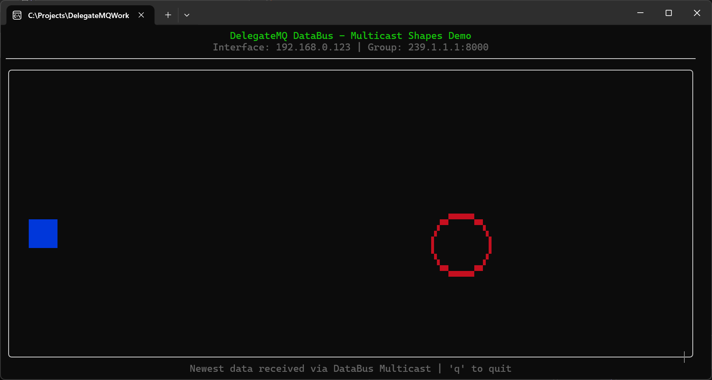

# DataBus Shapes Demo Example

The **Shapes Demo** is a graphical demonstration of the **DelegateMQ DataBus** capabilities. It provides a visual proof-of-concept for high-performance messaging, location transparency, and multicast distribution entirely within a modern Terminal User Interface (TUI).



## Key Features

- **Location Transparency**: The client renders shape movements calculated in a completely separate server process.
- **UDP Multicast**: A single publisher (Server) can drive any number of graphical clients simultaneously with zero extra network overhead per client.
- **Asynchronous Rendering**: Demonstrates thread-safe data transfer between a background network thread and the main UI rendering thread.
- **TUI Graphics**: Uses the [FTXUI](https://github.com/ArthurSonzogni/FTXUI) library to draw high-resolution shapes inside a standard terminal.

## How to Run

1. **Configure and Build**:
   Use the `03_generate_samples.py` script in the root directory, or run CMake manually in both `client` and `server` folders:
   ```bash
   cmake -B build .
   cmake --build build --config Release
   ```

2. **Start the Server**:
   The server calculates shape trajectories and broadcasts them to the multicast group.
   ```bash
   ./server/build/Release/delegate_databus_shapes_server.exe
   ```

3. **Start Multiple Clients**:
   You can run multiple instances of the client simultaneously. Because the system uses **UDP Multicast**, all clients will show the shapes moving in perfect synchronization.
   ```bash
   ./client/build/Release/delegate_databus_shapes_client.exe
   ```

## DataBus Spy Integration

This project is fully integrated with the **DelegateMQ Spy Console**. 

### Enabling the Spy Bridge
The server-side bridge is enabled by default in the `CMakeLists.txt` via the `DMQ_DATABUS_SPY` option. To monitor the raw coordinate data flowing through the bus:

1. Start the **Spy Console** from the `DelegateMQ-Tools` project:
   ```bash
   ./dmq-spy 9999 --multicast 239.1.1.1
   ```
2. Run the Shapes Demo server.
3. Observe the `Shape/Square` and `Shape/Circle` coordinate updates in real-time on the spy dashboard.

## Technical Details

- **Multicast Group**: `239.1.1.1:8000`
- **TUI Refresh Rate**: 20 FPS (Optimized for terminal performance)
- **Automatic Interface Detection**: The demo automatically identifies and binds to the primary physical network adapter, ensuring reliable multicast routing on Windows and Linux.
