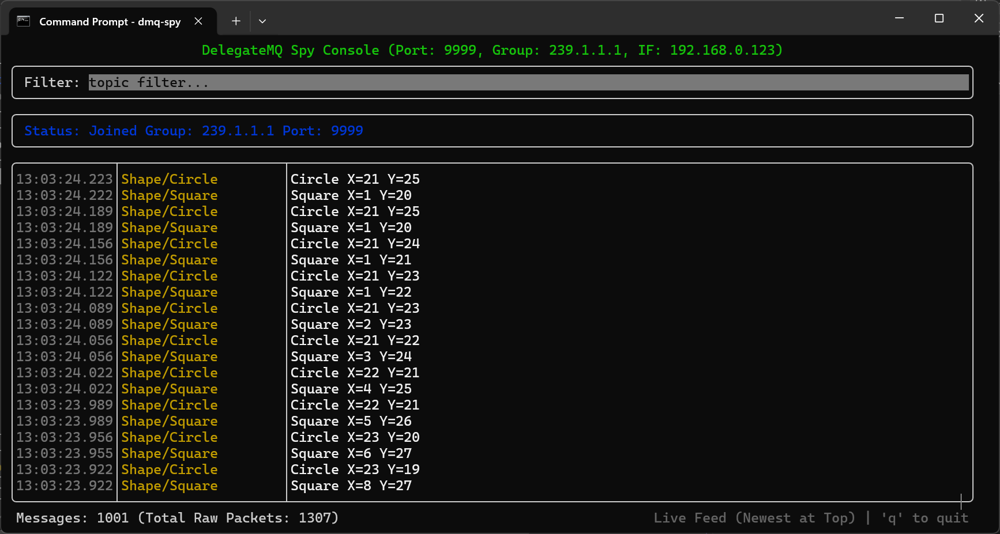
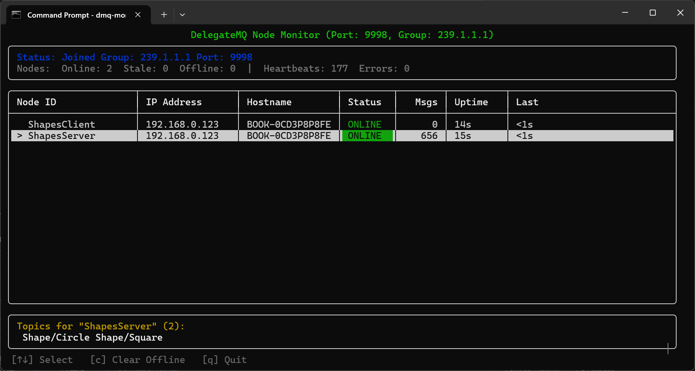

# DelegateMQ Tools

Diagnostic tools and Terminal User Interface (TUI) dashboards for the DelegateMQ DataBus. Two complementary consoles plus the bridge components needed to integrate them into your application.

## Tools Overview

| Tool | Executable | Purpose |
|------|------------|---------|
| **Spy Console** | `dmq-spy` | Real-time live feed of all DataBus messages — acts as a "Software Logic Analyzer" |
| **Node Monitor** | `dmq-monitor` | Live network topology view — shows all active nodes, their status, uptime, and published topics |

---

## dmq-spy — DataBus Spy Console

**DelegateMQ Spy** is a modern, standalone diagnostic TUI for the DelegateMQ DataBus. It captures, filters, and displays every message published to the bus in real-time across threads and network boundaries.



### Key Features

*   **Real-Time Live Feed**: Instant visualization of every message published to the `dmq::DataBus` (Newest at Top).
*   **Regex-Based Filtering**: Dynamically filter topics using regular expressions to isolate specific system events.
*   **Unicast & Multicast Support**: Monitor point-to-point traffic or join a multicast group for one-to-many monitoring.
*   **Auto-IP Detection**: Automatically identifies the correct physical network interface for multicast joining on Windows.
*   **Log to Disk**: High-performance background logging to a file for later historical analysis.
*   **High-Resolution Timestamps**: Every packet is timestamped at the source with microsecond precision using monotonic clocks.
*   **Zero-Impact Architecture**: The Spy Bridge uses an asynchronous internal queue and a dedicated background thread to ensure monitoring never blocks or slows down your main application.
*   **Standalone TUI**: Built with [FTXUI](https://github.com/ArthurSonzogni/FTXUI), providing a responsive, full-screen dashboard in any terminal.

### How it Works

1.  **The Spy Console** (`spy/main.cpp`): The standalone `dmq-spy` application that displays the data.
2.  **The Spy Bridge** (`bridge/SpyBridge.cpp/.h`): A small component you add to your own application to export its internal bus traffic over UDP.

Data is serialized using [Bitsery](https://github.com/fraillt/bitsery) and transmitted over UDP.

### Integrating SpyBridge into Your App

#### 1. Include the Bridge
Add `tools/bridge/SpyBridge.cpp` and `tools/bridge/SpyBridge.h` to your build system and enable `DMQ_DATABUS_TOOLS`.

#### 2. Register Stringifiers
For every topic you want to see in the console, register a stringifier function:

```cpp
dmq::DataBus::RegisterStringifier<MyData>("sensor/temp", [](const MyData& d) {
    return std::to_string(d.value) + " C";
});
```

#### 3. Start the Bridge
Call `Start` (unicast) or `StartMulticast` at application initialization:

```cpp
#include "SpyBridge.h"

int main() {
    // Unicast to a specific console IP
    SpyBridge::Start("127.0.0.1", 9999);

    // OR: Multicast to a group (allows multiple consoles to listen)
    // SpyBridge::StartMulticast("239.1.1.1", 9999);

    // ... your app logic ...
    SpyBridge::Stop();
}
```

### Usage

```bash
./dmq-spy [port] [options]

# Basic unicast (default port 9999)
./dmq-spy

# Join a multicast group (auto-detects local interface)
./dmq-spy 9999 --multicast 239.1.1.1

# Join multicast on a specific network interface
./dmq-spy 9999 --multicast 239.1.1.1 --interface 192.168.1.5

# Log all traffic to a file
./dmq-spy 9999 --log traffic.log
```

---

## dmq-monitor — Node Monitor Console

**DelegateMQ Node Monitor** is a live network topology dashboard. Instead of showing individual messages, it shows *which nodes* are active on the DataBus network — their hostnames, IP addresses, uptime, total message counts, and the topics they publish. Nodes are color-coded by health status (Online / Stale / Offline).



### Key Features

*   **Live Node Table**: Displays all discovered nodes with status, IP address, hostname, message count, uptime, and time since last heartbeat.
*   **Health Status**: Nodes are color-coded — green (Online), yellow (Stale), red (Offline) — based on heartbeat recency.
*   **Multi-Machine Support**: Two nodes with the same name on different machines are shown as separate rows, identified by IP address.
*   **Topic Discovery**: Automatically discovers which DataBus topics each node publishes, displayed in a detail panel for the selected node.
*   **Unicast & Multicast Support**: Receive heartbeats point-to-point or via a shared multicast group.
*   **Interactive Navigation**: Arrow keys to select a node, `c` to clear offline entries, `q` to quit.
*   **Zero-Impact Architecture**: The Node Bridge uses a dedicated background thread with a 1-second heartbeat interval that does not block your application.

### How it Works

1.  **The Node Monitor Console** (`monitor/monitor_main.cpp`): The standalone `dmq-monitor` application that displays the topology table.
2.  **The Node Bridge** (`bridge/NodeBridge.cpp/.h`): A component you add to each application node. It subscribes to `DataBus::Monitor` to auto-discover topics and message counts, then broadcasts a `NodeInfoPacket` heartbeat over UDP every second.

### Integrating NodeBridge into Your App

#### 1. Include the Bridge
Add `tools/bridge/NodeBridge.cpp`, `tools/bridge/NodeBridge.h`, and `tools/bridge/NodeInfoPacket.h` to your build system and enable `DMQ_DATABUS_TOOLS`.

#### 2. Start the Bridge
Call `Start` (unicast) or `StartMulticast` at application initialization, providing a unique node ID:

```cpp
#include "NodeBridge.h"

int main() {
    // Unicast heartbeats to the monitor console
    NodeBridge::Start("SensorNode-1", "127.0.0.1", 9998);

    // OR: Multicast heartbeats (all monitors on the group will see this node)
    // NodeBridge::StartMulticast("SensorNode-1", "239.1.1.1", 9998);

    // ... your app logic ...
    NodeBridge::Stop();
}
```

Topic and message count tracking is automatic — NodeBridge subscribes to `DataBus::Monitor` internally and requires no per-topic registration.

### Usage

```bash
./dmq-monitor [port] [options]

# Basic unicast (default port 9998)
./dmq-monitor

# Join a multicast group (auto-detects local interface)
./dmq-monitor 9998 --multicast 239.1.1.1

# Join multicast on a specific network interface
./dmq-monitor 9998 --multicast 239.1.1.1 --interface 192.168.1.5
```

**Controls:**
- `↑` / `↓` — Select a node to view its topics
- `c` — Clear all offline nodes from the table
- `q` — Quit

---

## Building

### Prerequisites
*   C++17 compatible compiler.
*   CMake 3.15+.
*   Dependencies (managed via the workspace `01_fetch_repos.py` script):
    *   [FTXUI](https://github.com/ArthurSonzogni/FTXUI)
    *   [Bitsery](https://github.com/fraillt/bitsery)
    *   [spdlog](https://github.com/gabime/spdlog)

### Build Instructions

Tools are built as part of the DelegateMQ repository by enabling the `DMQ_TOOLS` option:

```bash
mkdir build
cd build
cmake -DDMQ_TOOLS=ON ..
cmake --build . --config Release
```

This produces three executables: `dmq-spy`, `dmq-monitor`, and `dmq-target` (a test application that exercises both bridges).

---

## License
Distributed under the MIT License. See `LICENSE` for more information.
