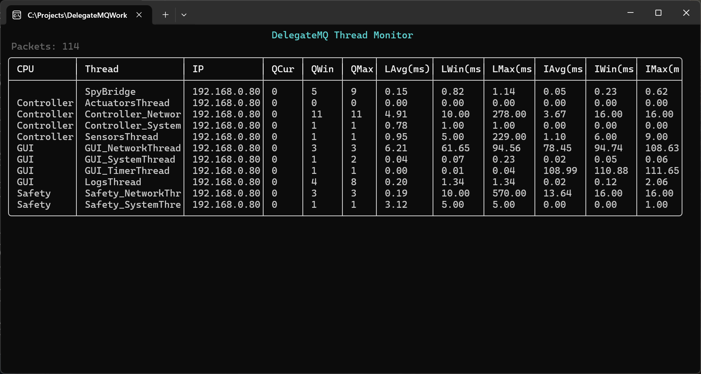

# DelegateMQ Tools

Diagnostic tools and Terminal User Interface (TUI) dashboards for the DelegateMQ `dmq::databus::DataBus`. Two complementary consoles plus the bridge components needed to integrate them into your application.

## Tools Overview

| Tool | Executable | Purpose |
|------|------------|---------|
| **Spy Console** | `dmq-spy` | Real-time live feed of all DataBus messages — acts as a "Software Logic Analyzer" |
| **Node Monitor** | `dmq-monitor` | Live network topology view — shows all active nodes, their status, uptime, and published topics |
| **Thread Monitor**| `dmq-thread` | Real-time per-thread metrics — shows queue depths and dispatch latency across the system |

---

## dmq-thread — Thread Monitor Console

**DelegateMQ Thread Monitor** is a performance diagnostics dashboard. It provides real-time visibility into the health of every instrumented thread in a distributed system, displaying queue depths and dispatch latency (avg/max).



### Key Features

*   **Per-Thread Metrics**: Tracks current, window-max, and all-time max queue depths.
*   **Latency Analysis**: Measures how long messages wait in the queue before being dispatched (Average and Max).
*   **CPU Grouping**: Threads are grouped by their logical CPU name (e.g. GUI, Controller, Safety).
*   **Real-Time 1Hz Updates**: Per-node telemetry is pushed to the dashboard every second.
*   **Multi-Node Aggregation**: Automatically aggregates and sorts threads from multiple physical machines or processes.
*   **Zero-Impact Design**: Statistics are captured atomically and transmitted via a dedicated background bridge to ensure no interference with application timing.

### How it Works

1.  **Instrumentation**: The `dmq::os::Thread` class tracks queue stats and message timestamps during normal operation.
2.  **Telemetry Service** (`ThreadMonitor`): A service within the application that polls registered threads and publishes `ThreadStatsPacket` to the local DataBus.
3.  **The Node Bridge** (`bridge/NodeBridge.cpp/.h`): Reuses the existing node bridge to automatically pick up `ThreadStatsPacket` topics and broadcast them over UDP.
4.  **The Thread Monitor Console** (`thread/thread_main.cpp`): The standalone `dmq-thread` application that receives and visualizes the aggregated telemetry.

### Integrating Thread Monitoring into Your App

#### 1. Register Threads
In your application initialization, register the threads you want to monitor:

```cpp
#include "extras/util/ThreadMonitor.h"

// ... create your threads ...
dmq::util::ThreadMonitor::Register(&mySystemThread);
dmq::util::ThreadMonitor::Register(&myNetworkThread);
```

#### 2. Start the Monitor
Enable the 1Hz telemetry polling:

```cpp
dmq::util::ThreadMonitor::Enable();
```

#### 3. Start NodeBridge
Ensure `NodeBridge` is started (see Node Monitor section above). It will automatically discover and broadcast the thread statistics.

### Usage

```bash
./dmq-thread [port] [options]

# Basic unicast (default port 9998)
./dmq-thread

# Join a multicast group (auto-detects local interface)
./dmq-thread 9998 --multicast 239.1.1.1
```

---

## dmq-spy — DataBus Spy Console

**DelegateMQ Spy** is a modern, standalone diagnostic TUI for the DelegateMQ `dmq::databus::DataBus`. It captures, filters, and displays every message published to the bus in real-time across threads and network boundaries. 

       

### Timing & Chrono-Sorting

`dmq-spy` uses a **Split-Timing Architecture** to provide stable diagnostics across distributed systems with unsynchronized clocks:

*   **Monotonic Session Timeline**: The "Session Time" (left column) is driven by the Spy tool's **local steady clock**. This ensures the timeline is always strictly increasing and starts at `0.000000` regardless of when remote nodes booted.
*   **High-Precision Jitter Analysis**: The `T-Delta` and `B-Delta` columns use the **remote source timestamps** contained within the packets. This preserves microsecond-accurate frequency analysis for each sender.
*   **Arrival-Order Sorting**: Messages are sorted by their physical arrival at the Spy tool. This prevents UI "jumps" caused by remote clock drift or network reordering.

#### Interpreting Negative Deltas
You may occasionally see negative values in the Delta columns (e.g., `-0.015` ms). This is a normal diagnostic indicator that reveals:
*   **Network Reordering**: A packet arrived at the Spy tool *after* a sibling packet, even though its source timestamp indicates it was sent *before*.
*   **Network Jitter**: Micro-fluctuations in network latency caused packets sent in rapid succession to swap positions during transit.
*   **Multi-Core Race Conditions**: On high-speed systems, two threads may publish to the bus so closely that the slightly later message physically hits the network wire first.

### Key Features

*   **Real-Time Live Feed**: Instant visualization of every message published to the `dmq::databus::DataBus` (Newest at Top).
*   **Regex-Based Filtering**: Dynamically filter topics using regular expressions to isolate specific system events.
*   **Intelligent Color-Coding**: Values are highlighted based on content (Green for OK/Running, Red for Error/Fault, Yellow for Warn).
*   **Unicast & Multicast Support**: Monitor point-to-point traffic or join a multicast group for one-to-many monitoring.
*   **Log to Disk**: High-performance background logging to a file for later historical analysis.
*   **High-Resolution Timestamps**: Every packet is timestamped at the source with microsecond precision using monotonic clocks.
*   **Pause & Resume**: Press `Ctrl-P` to freeze the display for inspection. Data continues to be gathered in the background circular buffer (2,000 entries).
*   **Zero-Impact Architecture**: The Spy Bridge uses an asynchronous internal queue and a dedicated background thread to ensure monitoring never blocks or slows down your main application.

### How it Works

1.  **The Spy Console** (`spy/main.cpp`): The standalone `dmq-spy` application that displays the data in an aligned table layout.
2.  **The Spy Bridge** (`bridge/SpyBridge.cpp/.h`): A small component you add to your own application to export its internal bus traffic over UDP.

### Integrating SpyBridge into Your App

#### 1. Include the Bridge
Add `tools/bridge/SpyBridge.cpp` and `tools/bridge/SpyBridge.h` to your build system and enable `DMQ_DATABUS_TOOLS`.

#### 2. Register Stringifiers
For every topic you want to see in the console, register a stringifier function:

```cpp
dmq::databus::DataBus::RegisterStringifier<MyData>("sensor/temp", [](const MyData& d) {
    return std::to_string(d.value) + " C";
});
```

#### 3. Start the Bridge
Call `Start` (unicast) or `StartMulticast` at application initialization. It is highly recommended to provide a unique **Node ID** so the Spy tool can distinguish between multiple processes running on the same machine:

```cpp
#include "SpyBridge.h"

int main() {
    // Unicast to a specific console IP with a unique Node ID
    SpyBridge::Start("127.0.0.1", 9999, "Node-Alpha");

    // OR: Multicast with a unique Node ID
    SpyBridge::StartMulticast("239.1.1.1", 9999, "Node-Beta");
}
```

### Distributed DataBus "Echo" Effect

In a distributed DelegateMQ system, you may see multiple nodes "sending" the same topic (e.g., both a Controller and a GUI sending `sensor/rpm`). This is a normal behavior of the DataBus architecture:

1.  The **Producer** (Controller) publishes the data locally.
2.  The **Network Bridge** transmits that data to the **Consumer** (GUI).
3.  The GUI's Network Bridge receives the data and calls `DataBus::Publish()` **locally** so that its own internal subscribers can hear it.
4.  The Spy tool reports a message from the "GUI" because the message physically appeared on the GUI's local bus.

These "reflections" indicate that the data has successfully traversed the network and is being injected into the remote node's bus.

### Usage

```bash
./dmq-spy [port] [options]

# Basic unicast (default port 9999)
./dmq-spy

# Log all traffic to a file
./dmq-spy 9999 --log traffic.log
```

**Controls:**
- `Ctrl-P` — Pause / Resume live feed
- `Ctrl-C` — Clear trace and reset session time
- `Ctrl-Q` — Quit

---

## dmq-monitor — Node Monitor Console

**DelegateMQ Node Monitor** is a live network topology dashboard. Instead of showing individual messages, it shows *which nodes* are active on the DataBus network — their hostnames, IP addresses, uptime, total message counts, and the topics they publish. Nodes are color-coded by health status (Online / Stale / Offline).


### Key Features

*   **Live Node Table**: Displays all discovered nodes with status, IP address, hostname, message count, uptime, and time since last heartbeat.
*   **Health Status**: Nodes are color-coded — green (Online), yellow (Stale), red (Offline) — based on heartbeat recency.
*   **Multi-Machine Support**: Two nodes with the same name on different machines are shown as separate rows, identified by IP address.
*   **Topic Discovery**: Automatically discovers which DataBus topics each node publishes, displayed in a detail panel for the selected node.
*   **Unicast & Multicast Support**: Receive heartbeats point-to-point or via a shared multicast group.
*   **Interactive Navigation**: Arrow keys to select a node, `c` to clear offline entries, `q` to quit.
*   **Zero-Impact Architecture**: The Node Bridge uses a dedicated background thread with a 1-second heartbeat interval that does not block your application.

### How it Works

1.  **The Node Monitor Console** (`monitor/monitor_main.cpp`): The standalone `dmq-monitor` application that displays the topology table.
2.  **The Node Bridge** (`bridge/NodeBridge.cpp/.h`): A component you add to each application node. It subscribes to `dmq::databus::DataBus::Monitor` to auto-discover topics and message counts, then broadcasts a `dmq::NodeInfoPacket` heartbeat over UDP every second.

### Integrating NodeBridge into Your App

#### 1. Include the Bridge
Add `tools/bridge/NodeBridge.cpp`, `tools/bridge/NodeBridge.h`, and `tools/bridge/NodeInfoPacket.h` to your build system and enable `DMQ_DATABUS_TOOLS`.

#### 2. Start the Bridge
Call `Start` (unicast) or `StartMulticast` at application initialization, providing a unique node ID:

```cpp
#include "NodeBridge.h"

int main() {
    // Unicast heartbeats to the monitor console
    NodeBridge::Start("SensorNode-1", "127.0.0.1", 9998);

    // ... your app logic ...
    NodeBridge::Stop();
}
```

Topic and message count tracking is automatic — NodeBridge subscribes to `dmq::databus::DataBus::Monitor` internally and requires no per-topic registration.

### Usage

```bash
./dmq-monitor [port] [options]

# Basic unicast (default port 9998)
./dmq-monitor

# Join a multicast group (auto-detects local interface)
./dmq-monitor 9998 --multicast 239.1.1.1
```

**Controls:**
- `↑` / `↓` — Select a node to view its topics
- `c` — Clear all offline nodes from the table
- `q` — Quit

---

## Building

### Prerequisites
*   C++17 compatible compiler.
*   CMake 3.15+.
*   Dependencies (managed via the workspace `01_fetch_repos.py` script):
    *   [FTXUI](https://github.com/ArthurSonzogni/FTXUI)
    *   [spdlog](https://github.com/gabime/spdlog)

### Build Instructions

Tools are built as part of the DelegateMQ repository by enabling the `DMQ_TOOLS` option:

```bash
mkdir build
cd build
cmake -DDMQ_TOOLS=ON ..
cmake --build . --config Release
```

This produces three executables: `dmq-spy`, `dmq-monitor`, and `dmq-target` (a test application that exercises both bridges).

---

## License
Distributed under the MIT License. See `LICENSE` for more information.
